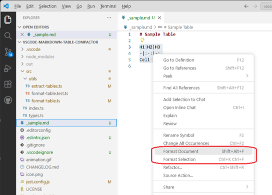
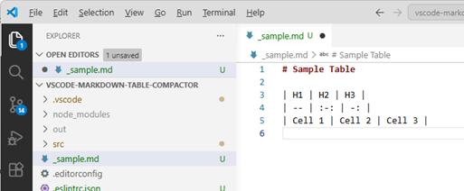

# Benny-G / Markdown Table Compactor

Format Markdown tables using 'compact' style compatible with [markdownlint/MD060](https://github.com/DavidAnson/markdownlint/blob/main/doc/md060.md) with 'aligned_delimiter' enabled.

_like this:_

```yml
"MD060": {
    "style": "compact",
    "aligned_delimiter": true
}
```

Compact table formatting reduces noise from white space updates in pull requests making it easier to see and review **_actual changes made_**.

It also reduces diff sizes, but that's more of a bonus.

## Usage

Runs as part of VS Code `Format Document` and `Format Selection`.



Great success!



### Settings

- **enable** - Enable or disable the formatter.
- **spacePadding** - Pad columns with a single space. (default: `true`)
- **keepFirstAndLastPipes** - Keep first and last pipes `|` in table formatting. (tables are easier to render when pipes are kept)
- **emptyPlaceholder** - Value to insert when a cell is empty. (empty by default, `-` commonly used)

<!-- prompt: Make sure the config descriptions in package.json and types.ts match the descriptions in the repo README.md file. -->

## License

See: [LICENSE](./LICENSE)

---

## Package and install locally

You can build and install locally while this is under development.

1. Clone <https://github.com/Benny-G/vscode-markdown-table-compactor> and run VS Code.

1. Install @vscode/vsce if you don't already have it.

   ```shell
   npm install -g @vscode/vsce
   ```

1. Lint, compile the code, build the package.

   ```shell
   npm run release # This will lint, compile and package
   ```

   Now you have a `vsix` file! _(should be called something like: `vscode-markdown-table-compactor-1.0.1.vsix`)_

   > [!NOTE]
   > Version is taken from [package.json](package.json). Don't forget to update the version number and note major changes in [CHANGELOG.md](CHANGELOG.md) as you go.

1. To install the package in VS Code so it's available every time you run VS Code:

   ```shell
   code --install-extension vscode-markdown-table-compactor-1.0.1.vsix
   ```

   > [!TIP]
   > Use the -force parameter to overwrite a previously installed version of the package.
   >
   > ```shell
   > code --install-extension vscode-markdown-table-compactor-1.0.1.vsix --force
   > ```
